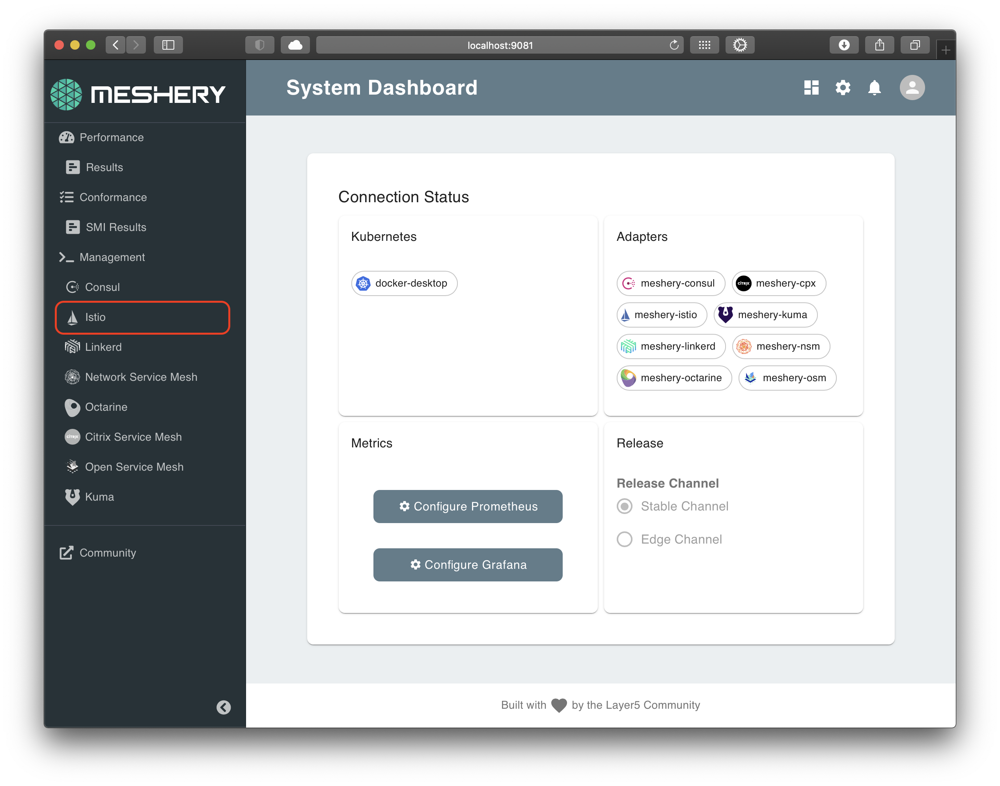
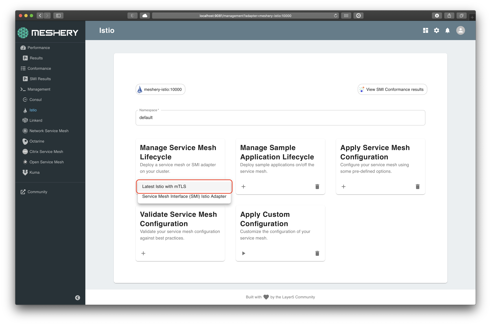

# Lab 1 - Setup Istio

Now that we have a Kubernetes cluster and Meshery, we are ready to download and deploy Istio resources.

## Steps

- [1. Install Istio](#1)
- [2. Verify install](#2)
- [3. Confirm add-ons](#3)

Optional (manual install of Istio):

- [1. Download Istio resources](#1.1)
- [2. Setup `istioctl`](#1.2)

## <a name="1"></a> 1 - Install Istio

Using Meshery, select Istio from the `Management` menu.

<a href="img/istio-adapter.png">

</a>

In the Istio management page:

1. Type `istio-system` into the namespace field.
1. Click the (+) icon on the `Install` card and select `Latest Istio` to install the latest version of Istio.

   <a href="img/install-istio.png">
   
   </a>

<small>For manual steps go [here](#appendix)</small>

## <a name="2"></a> 2 - Verify install

On the Istio adapter's management page, on the `Validate Service Mesh Configuration` card, you can click on the (+) icon and select `Verify Installation` to verify the Istio installation inside the cluster.

#### Alternatively:

Istio is deployed in a separate Kubernetes namespace `istio-system`. To check if Istio is deployed, and also, to see all the pieces that are deployed, execute the following:

```sh
kubectl get all -n istio-system
```

## <a name="3"></a> 3 - Install Add-ons

Istio, as part of this workshop, is installed with several optional addons like:

1. [Prometheus](https://prometheus.io/)
2. [Grafana](https://grafana.com/)
3. [Zipkin](https://zipkin.io/)
4. [Jaeger](https://www.jaegertracing.io/)
5. [Kiali](https://www.kiali.io/)

You will use Prometheus and Grafana for collecting and viewing metrics, while for viewing distributed traces, you can choose between [Zipkin](https://zipkin.io/) or [Jaeger](https://www.jaegertracing.io/). In this training, we will use Jaeger.
Kiali is another add-on which can be used to generate a graph of services within an Istio mesh and is deployed as part of Istio in this lab.

<h2>
  <a href="../lab-2/README.md">
  
  Continue to Lab 2</a>: Deploy a sample app - BookInfo
</h2>

<br />
<hr />

Alternative, manual installation steps are provided for reference below. No need to execute these if you have performed the steps above.

<hr />

## <a name="appendix"></a> Appendix - Alternative Manual Install

### <a name="1.1"></a> 1.1 - Download Istio

You will download and deploy the latest Istio resources on your Kubernetes cluster.

**_Note to Docker Desktop users:_** please ensure your Docker VM has atleast 4GiB of Memory, which is required for all services to run.

On your local machine:

```sh
curl -L https://git.io/getLatestIstio | ISTIO_VERSION=1.7.3 sh -
```

### <a name="1.2"></a> 1.2 - Setting up istioctl

On a \*nix system, you can setup istioctl by doing the following:

The above command will get the latest Istio package and untar it in the same folder.

Change into the Istio package directory and add the `istioctl` client to your PATH environment variable.

```sh
cd istio-*
export PATH=$PWD/bin:$PATH
```

To verify `istioctl` is setup lets try to print out the command help

```sh
istioctl version
```

We can use a new feature in istioctl to check if the cluster is ready for install:

```sh
istioctl verify-install
```

### Install Istio:

To install istio with a `demo` profile, execute the below command.

```sh
istioctl install --set profile=demo
```
