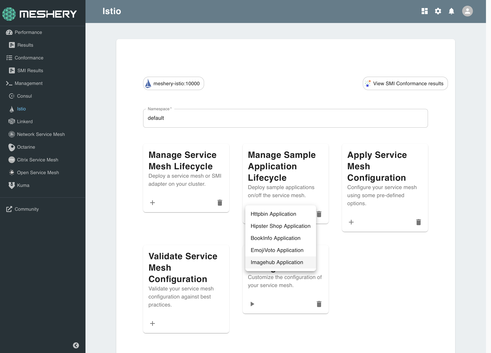
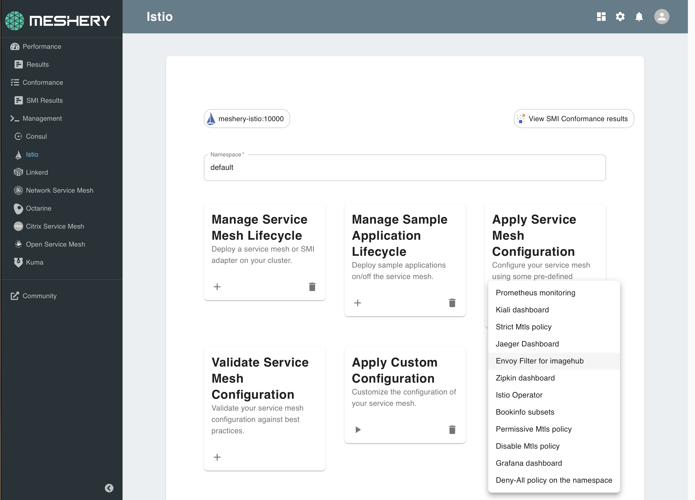

# Lab 7 - WebAssembly and intelligent data planes

In this lab, you will use the sample application [Image Hub](https://github.com/layer5io/image-hub).

## 7.1. Deploy Sample Application

Using Meshery, select Istio from the `Management` menu.

In the Istio management page:

1. Type `default` into the namespace field.
1. Click the (+) icon on the `Manage Sample Application Lifecycle` card and select `Image Hub Application` to install the latest version of Image Hub

<a href="img/install-imagehub.png">

</a>

## 7.2 Load the filter

Next, load the custom Envoy filter. This filter is written in Rust and is compiled against WebAssembly as it's target runtime.

Using Meshery, select Istio from the `Management` menu.

In the Istio management page:

1. Type `default` into the namespace field.
1. Click the (+) icon on the `Apply Service Mesh Configuration` card and select `Envoy Filter for Image Hub` to deploy the custom filter.

<a href="img/deploy-envoyfilter.png">

</a>

## 7.3 Send traffic

## 7.4 Analyze behavior

<hr />

Alternative, manual installation steps are provided for reference below. No need to execute these if you have performed the steps above.

<hr />

## <a name="appendix"></a> Appendix - Alternative Manual Install

Manually deploy the imagehub-filter.

```yaml
apiVersion: networking.istio.io/v1alpha3
kind: EnvoyFilter
metadata:
  name: custom-filter
spec:
  configPatches:
    - applyTo: HTTP_FILTER
      match:
        context: SIDECAR_OUTBOUND # will match outbound listeners in all sidecars
        listener:
          portNumber: 9080
          filterChain:
            name: envoy.http_connection_manager
            filter:
              name: "envoy.tcp_proxy"
      patch:
        operation: INSERT_BEFORE
        value:
          # This is the full filter config including the name and config or typed_config section.
          name: "envoy.filters.http.wasm"
          config:
            config:
              name: custom-filter
              rootId: my_root_id
              vmConfig:
                code:
                  local:
                    filename: /var/lib/imagehub/filter.wasm
                runtime: envoy.wasm.runtime.v8
                vmId: custom-filter
                allow_precompiled: true
  workloadSelector:
    labels:
      app: api-v1
      version: v1
```

Manually patch the Image Hub Deployment.

```json
---(
  // kubectl patch deployment/api-v1 -p '
  {
    "spec": {
      "template": {
        "metadata": {
          "annotations": {
            "sidecar.istio.io/userVolumeMount": "[{\"mountPath\":\"/var/lib/imagehub\",\"name\":\"wasm-filter\"}]"
          }
        },
        "spec": {
          "initContainers": [
            {
              "command": [
                "curl",
                "-L",
                "-o",
                "/var/lib/imagehub/filter.wasm",
                "https://github.com/layer5io/advanced-istio-service-mesh-workshop/raw/master/lab-7/ratelimiter/ratelimit-filter.wasm"
              ],
              "image": "curlimages/curl",
              "imagePullPolicy": "Always",
              "name": "add-wasm",
              "resources": {},
              "terminationMessagePath": "/dev/termination-log",
              "terminationMessagePolicy": "File",
              "volumeMounts": [
                {
                  "mountPath": "/var/lib/imagehub",
                  "name": "wasm-filter"
                }
              ]
            }
          ],
          "volumes": [
            {
              "emptyDir": {},
              "name": "wasm-filter"
            }
          ]
        }
      }
    }
  }
)
// '
```

<h2>
Thank you for taking this workshop!
</h2>
<br />

Star this repository and watch for updates.
